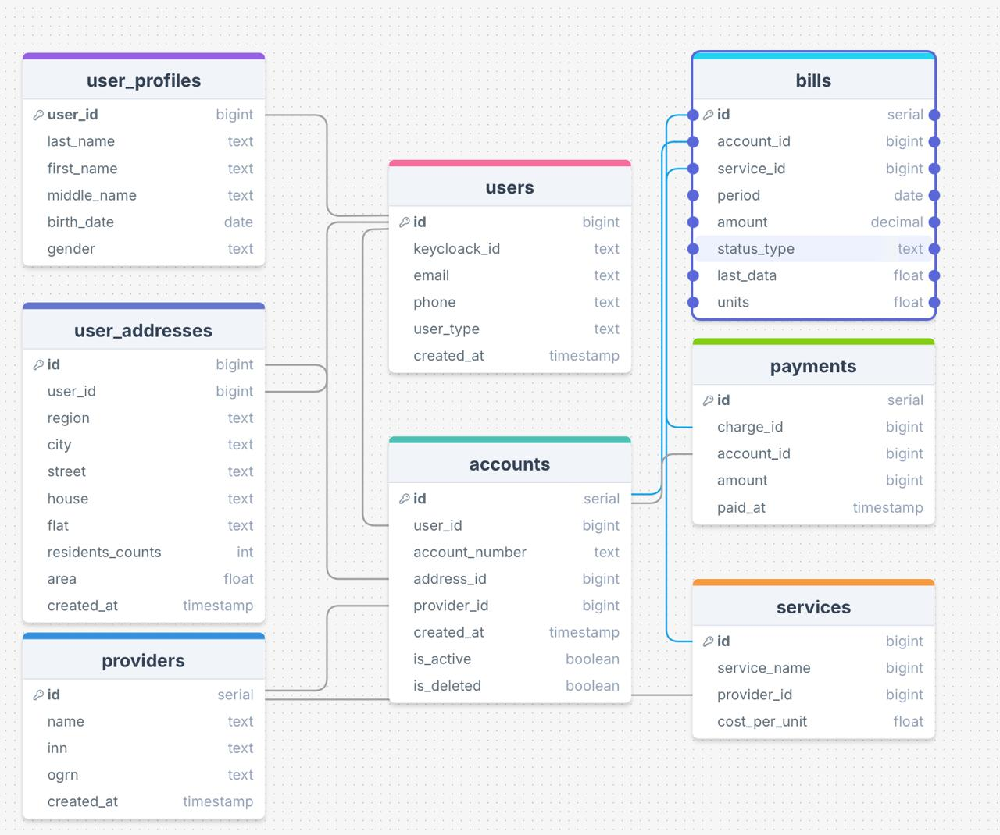

# Smart ЖКХ - Micro-developers

## Описание решения

**Smart ЖКХ** — это микросервисное приложение разработанное для автоматизации жилищно-коммунальных действий.

## Стек технологий

- **Backend:** FastAPI (по микросервисной архитектуре)
- **Frontend:** HTML + CSS + React
- **Database:** PostgreSQL
- **Containerization:** Docker & Docker Compose
- **Auth:** Keycloak (в процессе интеграции)

## Реализованные микросервисы

- Все сервисы кроме Api-GateWay реализованы (Не успели развернуть KeyCloak)

## Запуск приложения

### Требования

- Установленные **Docker** и **Docker Compose**

### Установка

Создайте `.env` файл:
```bash
cp .env.example .env
```

Заполните все переменные окружения в `.env`, включая параметры Keycloak:

- `KC_DB_NAME`
- `KC_DB_USER`
- `KC_DB_PASSWORD`
- `KEYCLOAK_ADMIN`
- `KEYCLOAK_ADMIN_PASSWORD`

### Запуск всех микросервисов

```bash
docker-compose up -d
```

Проверка статуса:

```bash
docker-compose ps
```

### Остановка сервисов

```bash
docker-compose down
```

Полная остановка с удалением volumes (включая БД):

```bash
docker-compose down -v
```

---
Проверьте, установлен ли уже:


```bash 
node -v
npm -v 
```
Если нету, то установите.
```bash

cd smart-zhkh

npm run dev
```

---

## Интеграция Keycloak // TODO 

Если вы хотите включить авторизацию через Keycloak:

### 1. Добавьте в `docker-compose.yml` секцию:

```yaml
services:
  postgres-keycloak:
    image: postgres:15
    container_name: keycloak_postgres
    environment:
      POSTGRES_DB: ${KC_DB_NAME}
      POSTGRES_USER: ${KC_DB_USER}
      POSTGRES_PASSWORD: ${KC_DB_PASSWORD}

  keycloak:
    image: quay.io/keycloak/keycloak:24.0.3
    container_name: keycloak
    command: start-dev --import-realm
    environment:
      KC_DB: postgres
      KC_DB_URL_HOST: postgres-keycloak
      KC_DB_URL_PORT: 5432
      KC_DB_URL_DATABASE: ${KC_DB_NAME}
      KC_DB_USERNAME: ${KC_DB_USER}
      KC_DB_PASSWORD: ${KC_DB_PASSWORD}
      KEYCLOAK_ADMIN: ${KEYCLOAK_ADMIN}
      KEYCLOAK_ADMIN_PASSWORD: ${KEYCLOAK_ADMIN_PASSWORD}
    volumes:
      - ./keycloak/realm-export.json:/opt/keycloak/data/import/realm-export.json
    ports:
      - 8080:8080
    depends_on:
      - postgres-keycloak
```

### 2. Создайте `realm-export.json`

Можно взять из ./authentification_service/realm-export.json и адаптировать. Пример конфигурации клиента:

```json
{
  "clientId": "fastapi-client",
  "secret": "super-secret-key",
  "enabled": true,
  "protocol": "openid-connect",
  "publicClient": false,
  "redirectUris": ["http://localhost:8000/callback"],
  "baseUrl": "http://localhost:8000",
  "standardFlowEnabled": true,
  "directAccessGrantsEnabled": true,
  "webOrigins": ["+"],
  "attributes": {
    "post.logout.redirect.uris": "+"
  }
}
```

> Не забудьте заменить `secret` на актуальный, который можно получить в UI Keycloak.

### 3. Где взять `secret`

- Зайдите в админку Keycloak на `http://localhost:8080`
- Найдите клиента `fastapi-client` и скопируйте секрет

### 4. Настройте FastAPI

Убедитесь, что в FastAPI используются те же `client_id`, `client_secret` и `redirect_uri`.

--- 

